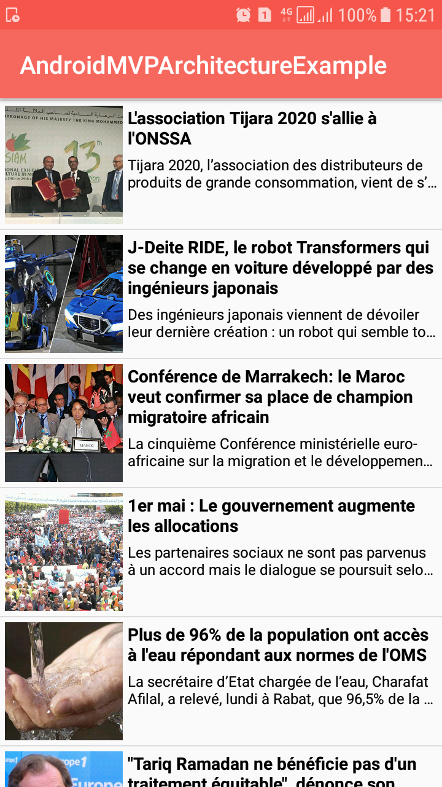

# ANDROID-MVP-ARCHITECTURE

Android MVP architecture with ButterKnife + Retrofit2 + RxJava2 + Room + Dagger

## Libraries

In this sample project includes some of useful libraries for Android, such as:

- [ButterKnife](http://jakewharton.github.io/butterknife/) : is a light weight library to inject views into Android components. It uses annotation processing.
- [Retrofit](http://square.github.io/retrofit/) : A type-safe REST client for Android which intelligently maps an API into a client interface using annotations.
- [Dagger](https://google.github.io/dagger/) : Dagger is a fully static, compile-time dependency injection framework for both Java and Android.
- [RxJava2](https://github.com/ReactiveX/RxJava) : Reactive Extensions for the JVM – a library for composing asynchronous and event-based programs using observable sequences for the Java VM.
- [Room](https://developer.android.com/training/data-storage/room/) : Room provides an abstraction layer over SQLite to allow fluent database access while harnessing the full power of SQLite.

## News API

This project show the latest news of morocco using News API [https://newsapi.org/].

## Developed By

* Ali DOUIRI  - <my.alidouiri@gmail.com>

## License

MIT License

Copyright (c) 2018 Ali DOUIRI

Permission is hereby granted, free of charge, to any person obtaining a copy
of this software and associated documentation files (the "Software"), to deal
in the Software without restriction, including without limitation the rights
to use, copy, modify, merge, publish, distribute, sublicense, and/or sell
copies of the Software, and to permit persons to whom the Software is
furnished to do so, subject to the following conditions:

The above copyright notice and this permission notice shall be included in all
copies or substantial portions of the Software.

THE SOFTWARE IS PROVIDED "AS IS", WITHOUT WARRANTY OF ANY KIND, EXPRESS OR
IMPLIED, INCLUDING BUT NOT LIMITED TO THE WARRANTIES OF MERCHANTABILITY,
FITNESS FOR A PARTICULAR PURPOSE AND NONINFRINGEMENT. IN NO EVENT SHALL THE
AUTHORS OR COPYRIGHT HOLDERS BE LIABLE FOR ANY CLAIM, DAMAGES OR OTHER
LIABILITY, WHETHER IN AN ACTION OF CONTRACT, TORT OR OTHERWISE, ARISING FROM,
OUT OF OR IN CONNECTION WITH THE SOFTWARE OR THE USE OR OTHER DEALINGS IN THE
SOFTWARE.